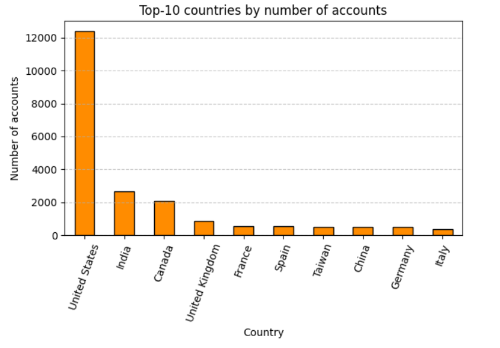

# Top Countries Email & Account Analysis

An analytical breakdown of global account creation and email interaction activity, identifying the top 10 countries by volume and engagement metrics.

## Project Overview

This project focuses on analyzing user engagement across different countries using structured data from account creation and email interactions. It uses SQL and Python to aggregate, rank, and visualize the most active countries in terms of:

* Accounts created
* Emails sent
* Emails opened and visits generated
* Country-level engagement rankings

## Table of Contents

* [Setup](#setup)
* [Data Structure](#data-structure)
* [Key Features](#key-features)
* [Main Findings](#main-findings)
* [Visualizations](#visualizations)
* [Future Work](#future-work)

## Setup

### Prerequisites

* Python 3.x
* Jupyter Notebook
* Google BigQuery Access

### Required Packages

* `pandas`
* `matplotlib`
* `seaborn`
* `google-cloud-bigquery`
* `google.colab` (if running in Colab)

### Running the Notebook

Clone the repository:

```bash
git clone https://github.com/your-username/top-countries-email-analysis.git
cd top-countries-email-analysis
```

Install dependencies:

```bash
pip install -r requirements.txt
```

Run the notebook:

```bash
jupyter notebook "Top Countries.ipynb"
```

## Data Structure

The analysis uses event-level and session-level data from a structured BigQuery dataset (`DA` schema), including:

* `account`, `account_session`, `session`, `session_params`
* `email_sent`, `email_open`, `email_visit`

### Key Fields:

* `country`: Country extracted from session parameters
* `account_cnt`: Number of accounts created
* `sent_msg`, `open_msg`, `visit_msg`: Email engagement metrics
* `send_interval`, `is_verified`, `is_unsubscribed`: Account properties

## Key Features

*  **SQL Union Query** to merge email and account datasets
*  **Country-level Aggregation** with BigQuery window functions
*  **Ranking System** for top 10 countries by accounts and emails
*  **Visual Analysis** using `matplotlib` and `seaborn`

## Main Findings

* Some countries lead in both account creation and email sending
* Email opens and visits vary widely, even among high-volume countries
* Verified and unsubscribed status may correlate with different engagement trends
* Seasonal or time-based activity patterns are noticeable

## Visualizations

* Bar charts of total accounts and emails by top countries
* Line plots of activity over time
* Heatmaps for interaction density
* Correlation matrices (optional)

## Future Work

* Add user segmentation by account verification and unsubscribed status
* Explore time-series trends by region or weekday
* Build interactive dashboards using Streamlit or Looker Studio
* Combine with marketing spend for ROI insights
